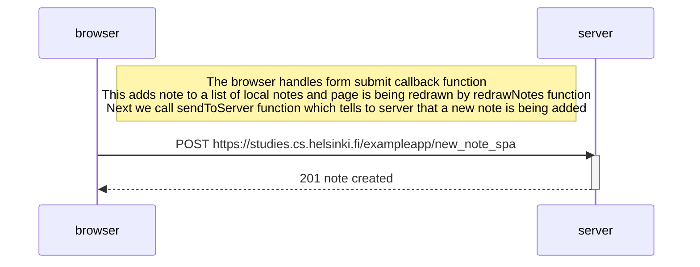

```mermaid
sequenceDiagram
    participant browser
    participant server

    Note right of browser: The browser handles form submit callback function<br/>This adds note to a list of local notes and page is being redrawn by redrawNotes function<br/>Next we call sendToServer function which tells to server that a new note is being added
    browser->>server: POST https://studies.cs.helsinki.fi/exampleapp/new_note_spa
    activate server

    server-->>browser: 201 note created

    deactivate server
```